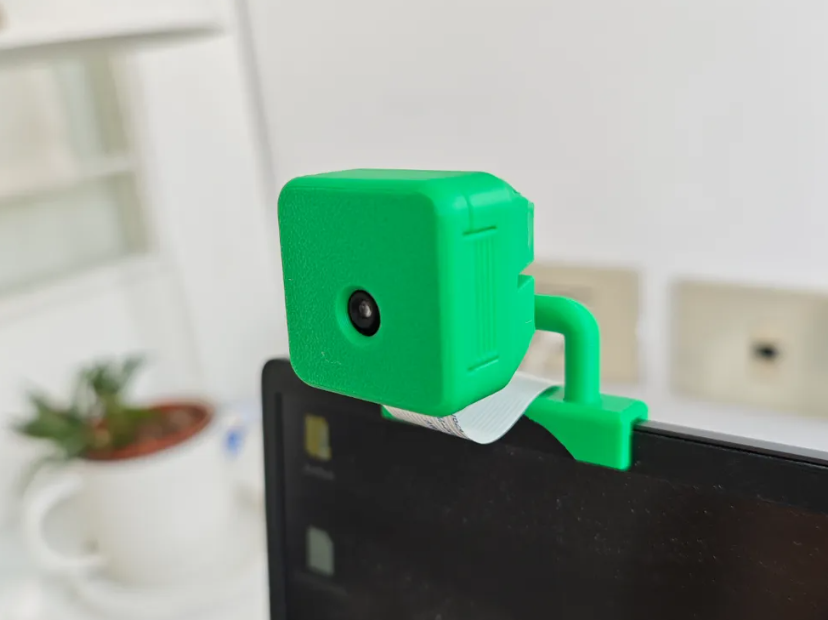

# 🌟 *Air Trackpad* 🌟

## 🖐️ Introduction

In this project the python libraries *MediaPipe* and *OpenCV* are used to create an innovative computer vision mouse that works in either Windows or Linux OS. The system captures hand gestures through a camera and classifies them into actions such as cursor movement, clicking, scrolling, and zooming. The project combines hand detection, gesture recognition, and computer vision techniques to deliver a seamless hands-free interface.

---

## ⚙️ Methodology

### ✋ Hand Detection and Tracking

*MediaPipe*'s hand detection system is used to detect and track key hand landmarks in real-time. The system extracts 3D coordinates for critical points such as fingertips and palm centers. These landmarks form the foundation for gesture classification.

**The detection process includes:**
1. 📸 *Frame Capture*: Real-time video is captured using OpenCV.
2. 🖐️ *Landmark Detection*: MediaPipe identifies and tracks hand landmarks.
3. 📐 *Landmark verification*: Landmarks are checked using a sobel filter on the ROI of the detected hand.

---

### 🤚 Gesture Recognition

The system recognizes complex gestures by analyzing the configuration and motion of hand landmarks. Gestures are mapped to actions such as:
- 🖱️ *Cursor Movement*: Index finger position defines cursor location.
- 🖱️ *Clicks*: Pinch gestures trigger left or right clicks.
- 📜 *Scrolling*: Vertical or horizontal swipes scroll the screen.
- 🔍 *Zooming*: Expanding or contracting finger distances adjusts zoom levels.

**To ensure robust detection:**
- Apply a Lukas Kanade optical flow algorithm to track hand movement between frames when the accuracy of the hand detection is low aiming to not lose the cursor position.

---

### 📍 Coordinate Mapping

Detected gestures are mapped to screen coordinates based on the display resolution. This ensures the system dynamically adapts to varying screen sizes and camera positions.

---

### 🧠 Advanced Techniques

1. **Movements classifier**:
   - Neural network that classifies the movements of the hand in the air.
   - Uses 10 neurons on the hidden layer to avoid complexity on the model.
   - The model can be charged with a pre-trained model or trained from scratch with an easy-to-use interface that records the movements that the user wants to classify.
---

## ✅ Results

The *Air Trackpad* performs reliably under various conditions:
- 🖐️ Gestures are accurately detected in real-time.
- 🚀 Cursor movements are smooth, thanks to stabilization techniques.
- 🖱️ Clicks, scrolling, and zoom actions are intuitive and responsive.

However, in challenging environments with excessive lighting variations or fast hand movements, minor delays or misclassifications may occur.

---

## 🚀 Future Improvements

To enhance the project:
1. 🖱️ Add support for more gestures, such as window switching or custom gestures for application shortcuts as well as a better classification of the current gestures.
2. ✂️ Implement real-time background removal to improve detection accuracy in cluttered environments.
3. 📦 Package the system as a standalone application for easy installation and use.
---

## 🎥 Video Demo

Check out the video demonstration of the Air Trackpad:  
👉 
---

## 👩‍💻 Authors

This project was developed by:
- *Lydia Ruiz Martínez* ([LydiaRuizMartinez](https://github.com/LydiaRuizMartinez))  
- *Pablo Tuñón Laguna* ([Drakit0](https://github.com/Drakit0))

---
