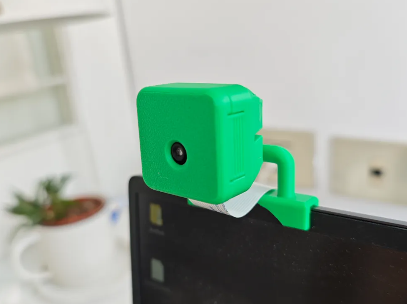

# AirTrackPad

Hand-gesture mouse for Windows, Linux and Raspberry Pi: a webcam or Pi camera replaces the trackpad, using MediaPipe hand tracking and a small neural network that classifies the gesture.

[Demo video](project_documentation/contents/video_example.mov) (the 3D-printed camera mount is shown below)

## What it does

The camera sees one or two hands. The program tracks 21 landmarks per hand, classifies the current gesture and turns it into a mouse action with PyAutoGUI. There are 11 classes:

| Class | Action |
|---|---|
| Pointing | Move the cursor with the index finger |
| Left Click, Right Click, Double Click | Clicks (see `movement_classifier/movements_documentation.txt` for the gestures) |
| Zoom In, Zoom Out | Zoom |
| Scroll Up, Scroll Down, Scroll Left, Scroll Right | Scroll in four directions |
| No Gesture | Nothing |

## How it works

1. **Landmarks.** MediaPipe Hands gives 21 landmarks per hand (`hand_tracking/HandsDetector.py`).
2. **Landmark check.** A Sobel filter is applied to the region of interest around the hand. The edge response gives an accuracy score for the detection.
3. **Fallback.** When the score is below 0.80, or MediaPipe loses the hand (for example by occlusion), the previous landmarks are carried forward with Lucas-Kanade optical flow, one flow per landmark (`movement_follower/FPSComplete.py`). A reduced mode uses smaller windows and fewer iterations for the Raspberry Pi.
4. **Classifier.** The landmark coordinates of both hands (154 features) go into a scikit-learn `MLPClassifier` with one hidden layer of 10 ReLU units, trained with Adam (`movement_classifier/`). Logistic regression was tried first and was less accurate. The report says 10 units was the size that still ran in real time on the Raspberry Pi.
5. **Actions.** `actions_handler/ActionsManager.py` maps the class to PyAutoGUI calls and uses a lock so actions run one at a time.

The first hand detection attempt, a Canny filter over a MOG2 background mask, was dropped because it was slow and unreliable (from the project report).

Camera calibration (`camera_calibration/CalibrateCamera.py`) uses chessboard images and OpenCV, and writes the intrinsics to a CSV file.

## Results

From the project report (`project_documentation/Documentation.pdf`, December 2024):

- about 30 fps in real time, without losing the hand
- about 90 % classification accuracy
- scrolling and two-hand gestures are the weakest classes

These figures are the report's own and were not re-measured.

## Run it

Python with a camera is needed. Install the dependencies:

    pip install -r requirements.txt

`requirements.txt` was frozen from the Raspberry Pi setup and includes `picamera2` and `python3-xlib`, which are not needed on Windows; remove them if pip fails on them.

Start it from the repository root:

    python airtrackpad.py          # Windows / any OS with a webcam
    python AirTrackPadLinux.py     # Raspberry Pi with Picamera2

Press `q` to quit. Press `l` to force the optical-flow step.

The scripts import `Utils` and `movement_classifier.Classifier`, while the files are named `utils.py` and `classifier.py`. This works on Windows. On a case-sensitive filesystem (Linux) the files need renaming or the imports need changing.

### Train your own gestures

Edit the gesture list in `movement_classifier/train_manager.py`, then from the repository root:

    python movement_classifier/train_manager.py

A window shows which gesture is being recorded. Press `s` to start recording and `e` to stop. Samples are saved to `movement_classifier/models/gesture_data.npy` and the model and scaler are written next to it. The report explains that the feature count (line 109 of `ClassifierTrainer.py`, 154 now) and the class count in `airtrackpad.py` must be updated if the gestures change.

### Calibrate a camera

Put chessboard photos (`.jpg`, 6x9 inner corners) in `raw_data/` and run:

    python camera_calibration/CalibrateCamera.py

## Structure

    airtrackpad.py, AirTrackPadLinux.py   main loops (webcam, Picamera2)
    hand_tracking/                        MediaPipe and Sobel check
    movement_follower/                    Lucas-Kanade fallback
    movement_classifier/                  MLP, trainer, saved model and data
    actions_handler/                      gesture to mouse action
    camera_calibration/                   chessboard calibration
    3d files/                             camera case and frame (.3mf)
    project_documentation/                report (PDF and LaTeX), poster, demo video

## Authors

- Lydia Ruiz Martínez ([LydiaRuizMartinez](https://github.com/LydiaRuizMartinez))
- Pablo Tuñón Laguna ([Drakit0](https://github.com/Drakit0))

Final project for Visión por Ordenador I, Universidad Pontificia Comillas (ICAI), course 2024-2025.
